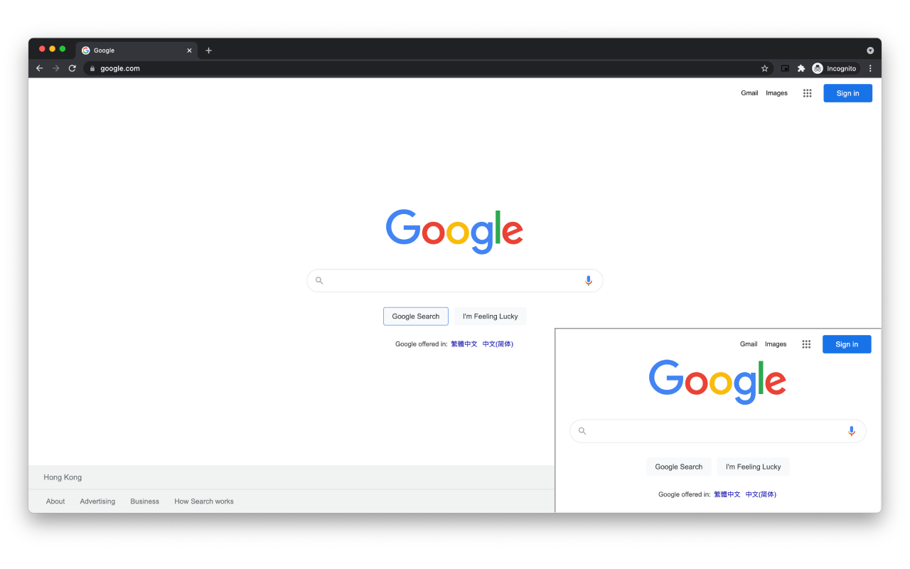
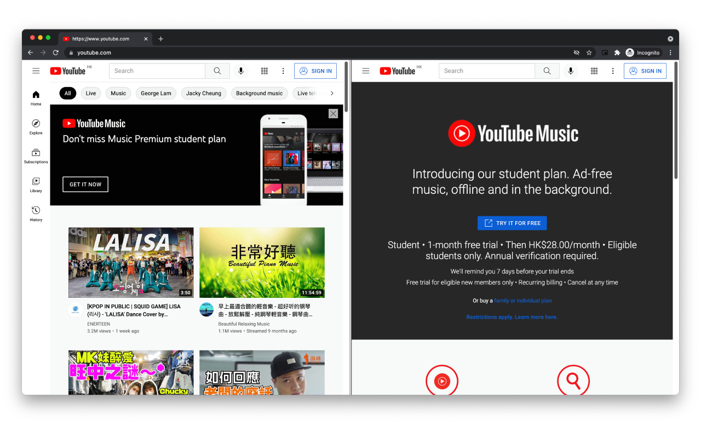

# WebPagePicture-in-Picture

Web page picture-in-picture mode allows you to view different web pages in a floating window.

網頁畫中畫模式允許您在浮動窗口中查看不同的網頁。

There are also some problems in the picture-in-picture webpage that need to be fixed, and some webpages are unavailable. 

畫中畫網頁也存在一些問題需要修復，部分網頁不可用。

# View Mode

# Split Mode
